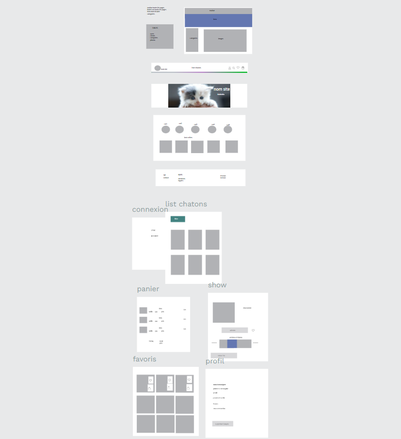

# Catzy

**Catzy** is an online store dedicated to selling kitten photos. This project aims to offer a simple and aesthetic experience for cat lovers, whether they are buyers or just visitors.

## Features

- Gallery of kitten photos sorted by themes
- Account creation
- Shopping cart and secure payment system
- Smart search by breed, color, vibe, or emotion
- Filter and sort system
- Add to favorites
- User data modification, export, and deletion

## Technologies Used

- Penpot (open-source prototyping tool)
  
[Maquette Catzy](https://design.penpot.app/#/workspace?team-id=e76c1915-6678-8010-8006-6f3c669215a4&project-id=e76c1915-6678-8010-8006-6f3c669215a5&file-id=e76c1915-6678-8010-8006-6f285b9cba85&page-id=3715a080-95f6-80ea-8006-6f752c06f56b&layout=layers&board-id=3715a080-95f6-80ea-8006-6f75409591b6)

Color palette: 7 shades from #E9F4F6 to #DFC5DE
Font: Rufina

