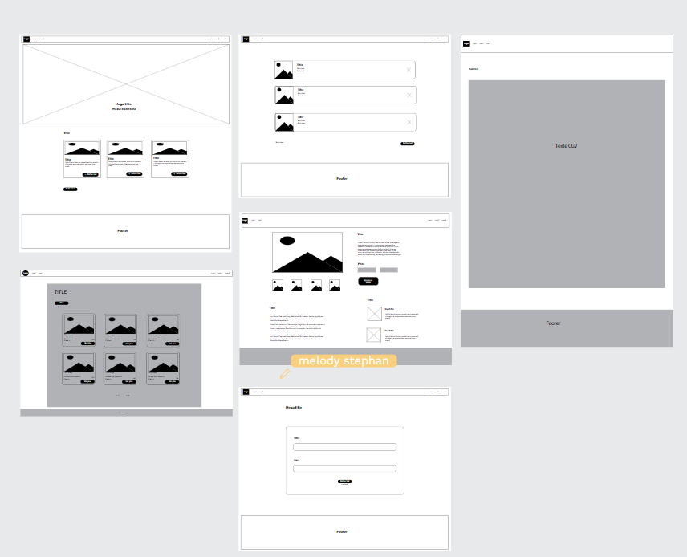

# Catzy - Plateforme de vente de photos de chatons

## Présentation
Nous comptons faire un site de vente en ligne de photos de chatons. Ce site s'intégrer dans l'univers concurrentiel de la photographie animalière.

Nos principaux concurrents sont les plateformes communautaires de vente en ligne, comme par exemple Etsy ou Redbubble.

Dans le cadre de ce projet, nous voulons réaliser notre plateforme de vente de photos de chatons.

L'objectif est d'avoir une plateforme qui présente nos photos de chatons et qui puisse les vendre. L'intérêt est d'avoir une visibilité en ligne sur nos activités.

## Déploiement sur Render

### Variables d'environnement à configurer :
- `DATABASE_URL` : URL de la base de données PostgreSQL (fournie par Render)
- `RAILS_MASTER_KEY` : Clé master Rails (contenu du fichier config/master.key)
- `RAILS_ENV=production`

### Configuration Render :
- **Build Command** : `./render-build.sh`
- **Start Command** : `bundle exec rails server -p $PORT`
- **Environment** : Ruby

### Business modeles charges Catzy
## Présentation
Nous comptons faire un site de vente en ligne de photos de chatons. Ce site s’intégrer dans l’univers concurrentiel de la photographie animalière.

Nos principaux concurrents sont les plateformes communautaires de vente en ligne, comme par exemple Etsy ou Redbubble.

Dans le cadre de ce projet, nous voulons réaliser notre plateforme de vente de photos de chatons.

L’objectif est d’avoir une plateforme qui présente nos photos de chatons et qui puisse les vendre. L’intérêt est d’avoir une visibilité en ligne sur nos activités.
### Business model
Le site vendra des images. Nous voulons à terme vendre des objets relatifs aux chats : des mugs, des magnets, des stickers.
### L’équipe en place
Nous sommes 2 :
Paul Durant, photographe depuis une vingtaine d’années
Lucie Martin, commerciale et passionnée de nos amis félins
### Nos clients
Pour le moment nos clients sont :

Les personnes voulant offrir à leur grands-parents une photographie de chat. Ces personnes ont majoritairement entre 16 et 40 ans
Nos résultats à date
Pour le moment nous n’avons pas encore lancé notre produit, donc pas de résultats à date.

D’ici la fin de l’année, nous comptons vendre pour 20 000€ de photos.
### Nos résultats escomptés dans 3 ans
À moyen terme, nous voulons vendre d’autre objets relatifs à l’univers félin et être les leaders des chats. Avec ces diversifications, nous comptons attendre un chiffre d’affaires de 250 000€.

## Wireframe

